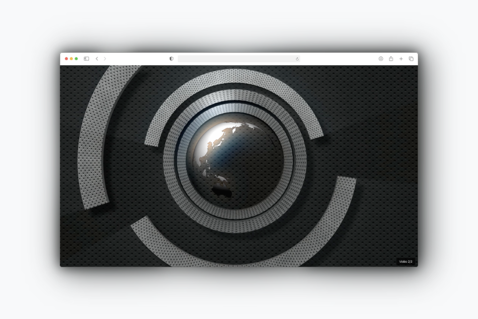

# Video séquence

### Installation

`npm install`

### Utilisation



Le projet teste l'idée d'enchaîner des vidéos les unes après les autres en cliquant dessus. Ce prototype est à essayer avec des vidéos qui proposent un effet de "zoom infini" qui permet de lire un récit en vidéo et de "plonger" dans un univers.

Pour changer les vidéos dans `components/VideoSequence.jsx` :

````
   const videos = [
        '/video1.mp4',
        '/video2.mp4',
        '/video3.mp4'
    ];
````